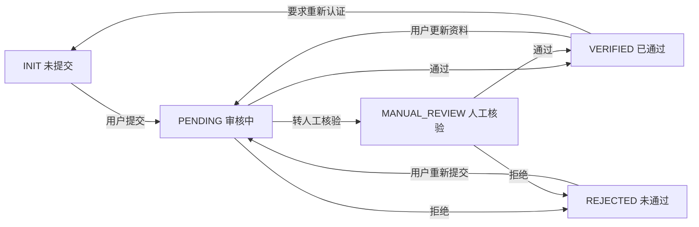
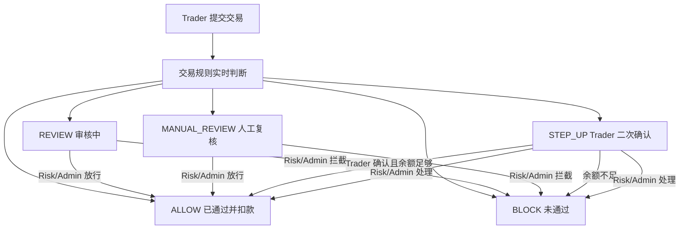

# RiskMind AI 当前版本完整用户手册

> 文档版本：2026-06-11  
> 适用范围：当前工作区中的 RiskMind AI MVP  
> 文档依据：当前前端、服务端规则和 `database.json` 数据结构

## 1. 产品说明

RiskMind AI 是一个面向金融交易平台的 B2B / B2B2C 风控与交易准入演示系统，包含以下四类角色：

| 角色 | 定位 | 核心职责 |
| --- | --- | --- |
| Trader | 平台交易客户 | 实名认证、充值、选择产品、申请交易、查看交易结果 |
| Risk Analyst | 风控分析人员 | 审核 Trader KYC、维护评分参数、处理风险交易、查看 Trader 风控日志 |
| Growth Analyst | 增长分析人员 | 查看聚合增长数据、漏斗、机会人群、实验与 AI 洞察 |
| Admin | 系统最高管理员 | 用户管理、全量 KYC 终审、交易终审、全量审计、AI 与系统配置、演示数据重置 |

系统遵循两条展示原则：

1. Trader 端只展示“能做什么、为什么暂时不能做、下一步怎么做”，不展示精确评分、黑名单、设备指纹、风控阈值等内部信息。
2. Risk Analyst 和 Admin 根据职责查看内部数据，但评分卡实验室只向 Risk Analyst 开放。

## 2. 安装与运行

### 2.1 环境要求

- Windows PowerShell 或命令提示符。
- 已安装 Node.js 和 npm。
- 项目目录：`F:\1D\myj\产品\riskmind-ai`

### 2.2 首次安装

```powershell
cd "F:\1D\myj\产品\riskmind-ai"
npm.cmd install
```

### 2.3 启动开发环境

```powershell
npm.cmd run dev
```

默认访问地址：

```text
http://127.0.0.1:3000
```

### 2.4 代码检查与生产构建

```powershell
npm.cmd run lint
npm.cmd run build
npm.cmd start
```

### 2.5 端口占用处理

如果出现：

```text
EADDRINUSE: address already in use 0.0.0.0:3000
```

说明已有程序占用 3000 端口。可以先查看占用进程：

```powershell
Get-NetTCPConnection -LocalPort 3000 | Select-Object LocalAddress,LocalPort,State,OwningProcess
```

确认是旧的开发服务后再结束对应进程：

```powershell
Stop-Process -Id <OwningProcess>
```

如果提示 Vite WebSocket 端口 `24678` 被占用，通常也是另一份 Vite 开发服务仍在运行。结束旧服务后重新执行 `npm.cmd run dev`。

## 3. 登录与全局操作

### 3.1 演示账号

| 用户名 | 演示密码 | 角色 |
| --- | --- | --- |
| `trader` | `trader123` | Trader |
| `vip_trader` | 演示环境使用 | Trader |
| `risk` | `risk123` | Risk Analyst |
| `growth` | `growth123` | Growth Analyst |
| `admin` | `admin123` | Admin |

当前版本属于 MVP：服务端登录主要按用户名识别账号，尚未实现生产级密码校验。不要把当前认证方式直接用于生产环境。

### 3.2 角色切换

左侧底部的角色切换区可以快速切换演示账号。切换后：

- 系统重新加载该角色的数据和左侧导航。
- 页面回到该角色默认工作台。
- 不同角色不能通过左侧导航进入其他角色的专属功能。

### 3.3 注销

点击“注销”后：

- 清除浏览器中的 `riskmind_token`。
- 清空当前登录用户状态。
- 返回登录页面。

如果注销后出现白屏，可刷新页面并重新访问 `http://127.0.0.1:3000`。

## 4. 权限与导航总览

| 功能 | Trader | Risk Analyst | Growth Analyst | Admin |
| --- | --- | --- | --- | --- |
| Trader 系统看板 | 可用 | 不可用 | 不可用 | 不可用 |
| 投资推荐与交易申请 | 可用 | 不可用 | 不可用 | 不可用 |
| Trader 充值 | 可用 | 不可用 | 不可用 | 不可用 |
| Trader KYC 审核 | 不可用 | 可用 | 不可用 | 可用 |
| 评分卡实验室 | 不可用 | 可用 | 不可用 | 不可用 |
| 交易风控处理 | 不可用 | 可用 | 不可用 | 不可用 |
| 聚合增长分析 | 不可用 | 不可用 | 可用 | 不通过 Growth 页面开放 |
| 用户管理 | 不可用 | 不可用 | 不可用 | 可用 |
| 全量 KYC 终审 | 不可用 | 不可用 | 不可用 | 可用 |
| 全量交易终审 | 不可用 | 不可用 | 不可用 | 可用 |
| 全量审计日志 | 不可用 | 仅 Trader 相关风控日志 | 不可用 | 可用 |
| AI / 系统配置 | 不可用 | 不可用 | 不可用 | 可用 |
| 演示数据重置 | 不可用 | 不可用 | 不可用 | 可用 |

## 5. KYC 认证规则

### 5.1 KYC 状态

| 内部状态 | 中文含义 | 用户可以做什么 |
| --- | --- | --- |
| `INIT` | 未提交 | 填写并提交认证资料 |
| `PENDING` | 审核中 | 查看已提交资料，等待审核 |
| `VERIFIED` | 已通过 | 使用已解锁的角色能力；Trader 可按交易权限交易 |
| `REJECTED` | 未通过 | 修改资料后重新提交 |
| `MANUAL_REVIEW` | 人工核验中 | 等待人工核验结果 |

### 5.2 提交资料

KYC 表单包含：

- 真实姓名。
- 证件号码。
- 出生日期。
- 国籍。
- 证件类型。
- 证件到期时间。

日期支持在界面中输入常见日期形式，服务端最终按 `YYYY-MM-DD` 保存。证件到期时间必须有效且不能早于当前日期。

提交设备和 IP 地址由服务端根据请求自动记录，用户不需要手工填写。

### 5.3 证件有效期

- KYC 有效期以用户提交的 `idDocumentExpiresAt` 为准。
- 系统不会用 `verifiedAt + 365 天` 自动推算到期日。
- Demo 中已通过但缺少到期日的预置资料会补为 `2030-12-31`。
- 证件已过期的 Trader 会暂停交易，必须重新认证。

### 5.4 已认证用户更新资料

这是当前版本的重要规则：

- Trader 已有一份未过期的 `VERIFIED` 认证时，可以提交更新资料。
- 新资料会显示为 `PENDING`。
- 旧认证在原到期日前仍然有效，因此审核期间 Trader 仍可交易。
- Dashboard 会显示“审核中（原认证有效）”及原认证到期时间。
- 只有旧认证已过期、从未认证或旧认证已失效时，`PENDING` 才会阻断交易。

该规则同样用于判断 Risk Analyst 和 Growth Analyst 自身认证能力是否仍有效。

### 5.5 KYC 状态流转



### 5.6 审核权限

- Risk Analyst 只能审核 Trader 的 KYC。
- Risk Analyst 自己必须具有有效认证，才能审核他人。
- Admin 可以审核所有角色的 KYC。
- Trader 和 Growth Analyst 没有审核权限。

## 6. 评分卡与交易权限

### 6.1 评分卡使用范围

评分卡实验室只向 Risk Analyst 开放。Admin、Growth Analyst 和 Trader 均无入口。

评分目标只能选择 Trader。评分使用的是 Trader 当前“实际有效账号认证结果”：

- 当前认证有效，包括旧认证在续期审核期间仍有效：按 `VERIFIED` 参与计算。
- 从未认证、认证失效或证件过期：按当前非通过状态参与计算。

### 6.2 输入参数与 WOE

| 输入项 | 区间 | WOE |
| --- | --- | --- |
| KYC 有效 | 是 | `+0.8` |
| KYC 有效 | 否 | `-1.2` |
| IP 变化 | 0 次 | `+0.6` |
| IP 变化 | 1-2 次 | `+0.1` |
| IP 变化 | 3 次及以上 | `-0.8` |
| 设备切换 | 0 次 | `+0.5` |
| 设备切换 | 1 次 | `+0.1` |
| 设备切换 | 2 次及以上 | `-0.9` |
| 1 分钟交易频率 | 少于 5 次 | `+0.4` |
| 1 分钟交易频率 | 5-15 次 | `0` |
| 1 分钟交易频率 | 16 次及以上 | `-1.0` |
| 黑名单 | 未命中 | `+0.7` |
| 黑名单 | 命中 | `-3.0` |

计算逻辑：

```text
Sum WOE = 各项 WOE 之和
PD = 1 / (1 + e ^ Sum WOE)
Score = 55 + 10 × Sum WOE
最终分数限制在 0-100
```

评分实验室右侧结果会随参数变化实时预览；点击“确认，保存参数”后才写入 `database.json`，并影响该 Trader 后续产品准入和交易判断。

### 6.3 分数与 Trader 交易权限

| 内部分数 / 等级 | Trader 展示 | 可交易产品 |
| --- | --- | --- |
| `80-100` / `LOW` | 高级交易权限 | 低风险、中风险、高风险 |
| `50-79` / `MEDIUM` | 标准交易权限 | 低风险、中风险 |
| `20-49` / `HIGH` | 基础交易权限 | 低风险 |
| `0-19` / `CRITICAL` | 暂停交易 | 无 |
| 无有效 KYC | 暂未开通交易权限 | 无 |

Trader 页面不会显示精确分数或 `LOW / MEDIUM / HIGH / CRITICAL` 内部用户风险等级。

## 7. Trader 操作手册

### 7.1 左侧导航

常驻菜单只有：

- 系统看板。
- 投资推荐。

“实名 KYC 系统”仅在没有有效认证时显示。有效认证用户可通过系统看板中的实名认证卡片进入更新资料。

以下页面属于隐藏业务流程，不会因为进入页面而自动出现在左侧栏：

- 充值 / 钱包。
- 交易申请。
- 交易记录。
- 产品详情。
- KYC 更新页面。

### 7.2 系统看板

系统看板展示：

- 账户状态。
- 当前交易权限。
- 可交易产品范围。
- 可用资金。
- KYC 到期日期或更新审核状态。

常用入口：

- “更新认证资料”：进入 KYC 页面。
- “充值”：进入隐藏的钱包充值页。
- “查看投资推荐”：进入产品列表。

### 7.3 充值

操作步骤：

1. 在系统看板点击“充值”。
2. 输入充值金额。
3. 选择或填写支付方式和备注。
4. 确认充值。
5. 页面停留在当前充值页并刷新余额与充值记录。

当前规则：

- 只有 Trader 可以充值。
- 金额必须大于 0。
- 最多保留两位小数。
- 单次充值硬限制为 `1,000,000`。
- 充值是模拟资金操作，成功后写入余额和充值记录。
- 当前“系统配置”中的单次充值上限尚未动态接入充值接口，实际接口仍使用上述硬限制。

### 7.4 投资推荐

产品卡片展示：

- 产品名称。
- 产品风险等级：低风险 / 中风险 / 高风险。
- 当前账户是否可交易。
- 用户侧推荐或不可交易说明。

可交易产品显示“发起交易”；不可交易产品按钮禁用并显示“暂不可交易”。

页面顶部可以进入“查看交易记录”。交易记录不会直接混在产品列表中。

### 7.5 发起交易

操作步骤：

1. 在可交易产品卡片点击“发起交易”。
2. 当前页面不跳转，打开交易申请弹窗。
3. 查看产品名称、产品风险等级和可用资金。
4. 输入交易金额。
5. 点击“提交交易申请”。
6. 提交期间按钮显示“提交中...”，弹窗保持打开。
7. 服务端返回后，弹窗切换为结果视图。
8. 只有用户点击“关闭”，弹窗才关闭；关闭后仍停留在投资推荐页。

提交后不会自动跳转系统看板、交易记录或其他页面。

### 7.6 交易规则与判定顺序

系统按以下顺序判断：

1. 是否具有有效 KYC。
2. 内部评分是否低于 20。
3. 是否命中黑名单。
4. 产品风险等级是否在当前评分区间允许范围内。
5. 最近 1 分钟交易申请是否达到 5 次。
6. 本次金额是否超过历史已通过交易平均金额的 3 倍。
7. 以上均未触发时自动通过。

没有历史已通过交易时，系统使用默认历史均值 `10,000`。

余额处理：

- `ALLOW`：余额足够时立即扣减。
- `BLOCK`：不扣减。
- `REVIEW` / `MANUAL_REVIEW`：等待人工处理，处理前不扣减。
- `STEP_UP`：等待 Trader 页面二次确认，确认通过后扣减。
- 自动通过时余额不足：提交失败，提示先充值。

### 7.7 交易结果

| 状态 | Trader 标题 | Trader 状态 | 余额影响 |
| --- | --- | --- | --- |
| `ALLOW` | 交易已提交并通过 | 已通过 | 已扣减 |
| `BLOCK` | 交易暂无法完成 | 未通过 | 不扣减 |
| `REVIEW` | 交易已提交审核 | 审核中 | 暂不扣减 |
| `MANUAL_REVIEW` | 交易已提交审核 | 审核中 | 暂不扣减 |
| `STEP_UP` | 交易需要进一步确认 | 待进一步确认 | 确认前不扣减 |

### 7.8 STEP_UP 二次确认

当交易金额明显偏离历史金额时，弹窗显示“确认继续”：

1. Trader 阅读警告并确认交易由本人发起。
2. 点击“确认继续”。
3. 余额足够：状态更新为 `ALLOW`，扣减余额。
4. 余额不足：状态更新为 `BLOCK`，提示先充值。
5. 结果仍显示在当前弹窗内，用户点击“关闭”后返回产品列表。

当前 MVP 的二次验证是页面确认，不包含短信 OTP、邮件验证码或外部身份认证。

### 7.9 交易记录

Trader 通过投资推荐页的“查看交易记录”进入，只能查看自己的交易：

- 交易编号。
- 申请时间。
- 产品 / 资产。
- 金额。
- 当前状态。
- 处理说明。

Trader 端会清洗内部原因，例如：

- 黑名单类原因显示为“账户状态暂不满足交易准入条件”。
- 高频类原因显示为“近期交易活动较频繁，需要进一步审核”。
- 金额偏离类原因显示为“本次交易金额需要进一步确认”。
- 评分或产品适当性原因显示为用户侧准入说明。

当前实现中 Trader 交易记录以列表为主，终态交易显示为只读，尚未提供独立的 Trader 交易详情弹窗。

## 8. Risk Analyst 操作手册

### 8.1 左侧导航

- 系统看板。
- KYC 审核中心。
- 评分卡实验室。
- 交易风控台。
- 风控审计日志。

Risk Analyst 不能进入 Admin、Growth 或 Trader 专属页面。

### 8.2 系统看板

展示：

- 待审核 Trader KYC。
- 待处理交易。
- 今日 `REVIEW`。
- 今日 `STEP_UP`。
- 今日 `BLOCK`。
- 高风险 Trader。
- 最近风控审计日志。
- 本人实名认证状态与入口。

Risk Analyst 自己没有有效 KYC 时，仍可查看工作台提示，但不能审核他人 KYC。

### 8.3 KYC 审核中心

只显示 Trader 的 KYC 资料。

操作规则：

| 当前状态 | 可执行操作 |
| --- | --- |
| `PENDING` | 通过、拒绝、转人工核验 |
| `MANUAL_REVIEW` | 通过、拒绝 |
| 其他状态 | 不进入常规待审核操作 |

拒绝和转人工核验应填写审核意见。提交后停留在当前页面并刷新状态。

### 8.4 评分卡实验室

操作步骤：

1. 选择一个 Trader。
2. 调整 IP 变化次数。
3. 调整设备切换次数。
4. 调整 1 分钟交易频率。
5. 设置是否命中黑名单。
6. 查看右侧实时变化的评分、PD、等级、建议和解释。
7. 点击“确认，保存参数”写入服务端。

保存后会立即影响该 Trader 的产品推荐范围和后续交易准入。

### 8.5 交易风控台

可筛选：

- Trader 姓名。
- 交易状态。
- 开始日期。
- 结束日期。
- 交易编号、产品或原因关键字。

可处理状态：

- `REVIEW`。
- `MANUAL_REVIEW`。
- `STEP_UP`。

人工处理动作只有：

- `ALLOW`。
- `BLOCK`。

`ALLOW` 和 `BLOCK` 是终态，不能重复处理。

当前演示规则中，Risk Analyst 人工放行但 Trader 余额不足时，系统会自动补足沙盒授信后再扣减。这是演示环境行为，不是生产资金规则。

### 8.6 风控审计日志

Risk Analyst 只能查看 Trader 相关日志。筛选项包括：

- Trader 姓名。
- 动作。
- 服务。
- `riskFlag`。
- 开始日期和结束日期。
- 关键字。

日志可展示请求 payload、响应状态和风险标记，但系统配置和密钥类信息不向 Risk Analyst 开放。

## 9. Growth Analyst 操作手册

### 9.1 左侧导航

- 增长总览。
- 漏斗与摩擦。
- 机会人群。
- 实验与 AI 洞察。

Growth Analyst 不能审核 KYC、调整评分卡、处理交易或进入 Admin 配置。

Growth Analyst 需要具有有效的本人 KYC 才能加载详细增长数据。各 Growth 页面提供本人实名认证入口，该入口不作为常驻侧栏菜单。

### 9.2 增长总览

展示：

- DAU、WAU、MAU。
- 新增注册用户。
- 注册转化率。
- KYC 提交率和通过率。
- 首充转化率和首单转化率。
- 活跃交易者。
- 累计 GMV。
- 人均 GMV / ARPU。
- 最大流失节点、最高价值渠道、最高 GMV 产品和 AI 摘要。

下方通过 Tab 查看：

- 渠道分析。
- 产品推荐转化。

### 9.3 漏斗与摩擦

九阶段漏斗：

1. 访问用户。
2. 注册用户。
3. 开始 KYC。
4. 提交 KYC。
5. KYC 通过。
6. 首次入金。
7. 首次交易。
8. 活跃交易者。
9. 留存交易者。

每个阶段展示人数、相对上一阶段转化率、相对访问总转化率和流失人数。

页面还包含：

- KYC 转化分析。
- 风控摩擦影响。

Growth 只能看到聚合统计，不显示精确评分、黑名单、IP、设备指纹或内部模型因子。

### 9.4 机会人群

包括：

- 注册未 KYC。
- KYC 开始未提交。
- KYC 提交待审核。
- KYC 通过未入金。
- 入金未交易。
- 首单后沉默。
- 高价值活跃用户。
- KYC 即将到期用户。

点击卡片可打开详情，查看脱敏用户名、注册时间、KYC 状态、入金金额、最近活跃时间、渠道和建议动作。

### 9.5 实验与 AI 洞察

“增长实验中心”支持：

- 查看实验列表。
- 点击“查看”打开实验详情。
- 查看目标人群、指标、状态、周期、假设、A/B 方案、结果和成功标准。
- 创建 Mock 实验。

“AI 增长洞察”支持：

- 生成或重新生成结构化报告。
- 复制报告。
- 导出文本报告。
- 生成触达文案。

结构化报告包括核心结论、最大流失、合规摩擦、机会人群、风控影响、运营动作和下周期实验建议。

## 10. Admin 操作手册

### 10.1 左侧导航

- 系统看板。
- 用户管理。
- KYC 终审中心。
- 交易终审中心。
- 审计日志中心。
- AI 配置中心。
- 系统配置。
- 演示数据控制台。

Admin 不显示评分卡实验室、Growth 页面和 Trader 客户功能。

### 10.2 系统看板

展示全局数据：

- 用户及角色数量。
- KYC 待审核、已通过和已拒绝数量。
- 待人工处理交易。
- 今日交易及各风险状态数量。
- 累计充值和 GMV。
- 当前 AI Provider。
- 系统运行状态。

快捷入口可进入用户、KYC、交易、日志、AI 配置和数据重置。

### 10.3 用户管理

支持：

- 按角色筛选。
- 按 KYC 状态筛选。
- 按账户状态筛选。
- 查看用户详情、余额、KYC 摘要和交易摘要。
- 启用或禁用用户。

被禁用用户不能登录。当前 Admin 不能禁用自己。

### 10.4 KYC 终审中心

Admin 可查看所有角色的 KYC。

| 当前状态 | 操作区 |
| --- | --- |
| `INIT` | 等待用户提交 |
| `PENDING` | 通过、拒绝、转人工核验 |
| `MANUAL_REVIEW` | 通过、拒绝 |
| `REJECTED` | 查看详情、等待用户重新提交 |
| `VERIFIED` 且有效 | 查看详情、要求重新认证 |
| `VERIFIED` 但已过期 | 查看详情、要求重新认证、转人工核验 |

规则：

- 状态变更前弹出二次确认。
- 拒绝、转人工核验、要求重新认证必须填写原因。
- 所有成功状态变更写入审计日志。
- 已通过用户不能直接再次“通过”或直接“拒绝”。

### 10.5 交易终审中心

Admin 可查看全量交易并按状态筛选。

- `REVIEW`、`MANUAL_REVIEW`、`STEP_UP` 可终审为 `ALLOW` 或 `BLOCK`。
- `ALLOW`、`BLOCK` 只能查看详情。
- 点击“查看详情”可打开交易详情弹窗。
- 详情包含交易编号、用户、产品、金额、状态、系统原因、审计信息、处理人、处理时间和余额扣减信息。

Admin 放行交易时必须具有真实可用余额；与 Risk Analyst 的演示沙盒授信行为不同。

### 10.6 审计日志中心

Admin 查看所有角色的日志，可先按角色筛选，再选择该角色下的人员。

日志包含：

- 时间。
- 操作人和角色。
- 动作类型。
- 服务 / 目标对象。
- 请求 payload。
- 响应结果。
- `riskFlag`。
- 操作结果。

### 10.7 AI 配置中心

支持：

- 查看和切换 `mock`、`ollama`、`gemini`。
- 配置 Ollama 地址。
- 配置 Gemini API Key。
- 测试连接。
- 保存配置。

密钥在页面中脱敏显示。当前配置写入正在运行的服务进程，重启服务后会重新读取 `.env`，不会自动改写 `.env` 文件。

### 10.8 系统配置

当前页面提供以下 MVP 配置：

- 默认币种。
- 单次充值上限。
- 单次交易金额上限。
- KYC 到期提醒天数。
- 是否允许未 KYC 模拟充值。
- 是否开启 AI 推荐理由。
- 是否开启 Mock 模式。
- 系统公告。

这些配置目前主要用于演示和界面保存，部分交易、充值硬规则尚未全部动态接入。

### 10.9 演示数据控制台

可重置：

- 所有演示数据。
- Trader KYC 和评分。
- Trader 余额。
- 交易记录。
- 充值记录。
- 审计日志。
- 默认 Mock 数据。

危险操作会要求二次确认。数据重置不可用于生产环境。

## 11. 交易状态总表



## 12. 数据保存与 Mock 口径

### 12.1 会保存到 `database.json`

- 用户信息和余额。
- KYC 资料及状态。
- 风险评分记录。
- 交易记录。
- 充值记录。
- 审计日志。
- 产品数据。

### 12.2 仅当前运行期间或前端会话有效

- AI Provider 的页面修改保存在当前服务进程环境中。
- 系统配置为当前服务进程内存配置。
- Growth 新建 Mock 实验保存在前端状态中，刷新页面后恢复预置实验。

### 12.3 Growth 数据口径

Growth 面板是 MVP 混合口径：

- 一部分指标来自 `database.json` 中的实际用户、KYC、充值和交易记录。
- 漏斗基准、渠道数据、部分机会人群和产品曝光数据使用 Mock 数据。
- 累计 GMV 包含真实已通过交易金额和预置演示基数。

因此 Growth 面板适合功能演示和流程验收，不应直接作为正式经营报表。

## 13. 审计日志说明

审计日志记录成功完成的关键业务请求，包括：

- 登录。
- KYC 提交和审核。
- 风险评分。
- 充值。
- 交易申请、二次确认和人工审核。
- 用户状态修改。
- AI / 系统配置修改。
- 数据重置。

日志的常见字段为：

- 操作人 ID、用户名和角色。
- 操作时间。
- 动作和服务。
- 请求 payload。
- 响应结果。
- `riskFlag`。

当前中间件主要记录成功响应；部分失败请求不会形成完整审计记录。

## 14. 常见问题

### 14.1 Trader 更新 KYC 后为什么显示审核中但仍能交易？

因为旧的 `VERIFIED` 认证尚未到期。新资料在审核期间不立即取消原有有效权限，系统会显示原认证有效截止日期。

### 14.2 Trader 为什么看不到精确风险分？

这是产品设计要求。Trader 只看到高级、标准、基础或暂停交易权限；精确评分和模型因子只用于内部风控。

### 14.3 提交交易后为什么没有自动返回产品页？

这是预期行为。结果必须保留在弹窗中，用户查看状态后主动点击“关闭”，才回到仍然打开的投资推荐页。

### 14.4 STEP_UP 为什么需要点击“确认继续”？

本次交易金额触发了金额偏离检查。当前 MVP 使用页面确认模拟二次验证，确认且余额足够后交易通过。

### 14.5 Risk Analyst 为什么不能审核 KYC？

检查 Risk Analyst 自己是否具有有效 KYC。只有自身认证有效时，才可以审核 Trader。

### 14.6 Growth 页面为什么没有数据？

检查 Growth Analyst 自己是否具有有效 KYC。未认证时页面会显示认证入口，完成 Admin 审核后才能加载详细数据。

### 14.7 Admin 为什么看不到评分卡实验室？

评分卡参数调试被定义为 Risk Analyst 专属能力。Admin 负责终审、配置和全局管理，不直接进行评分实验。

### 14.8 日期为什么提示格式无效？

请使用 `YYYY-MM-DD`，例如 `2030-05-12`。界面可能接受斜杠形式，但服务端保存格式统一为横杠。

### 14.9 交易通过后余额为什么变化？

`ALLOW` 会立即扣减余额；人工放行或 STEP_UP 确认通过也会扣减。审核中和未通过不会扣减。

## 15. 当前 MVP 限制

- 登录和令牌机制是演示实现，不具备生产级安全性。
- 数据存放在单个 JSON 文件，不适合并发生产业务。
- Growth 指标包含 Mock 数据。
- Growth 新建实验不会持久化。
- AI 和系统配置不会自动写回 `.env` 或数据库。
- STEP_UP 是页面确认，不是真实 OTP。
- Risk Analyst 人工放行时可能使用演示沙盒授信。
- 部分系统配置尚未接入实际交易规则。
- Trader 交易记录当前没有独立详情页。

正式上线前应补充数据库、密码哈希、会话安全、API 权限测试、配置持久化、真实二次验证、资金账本、幂等控制和完整失败审计。

## 16. 推荐验收顺序

1. 使用 Admin 检查用户和预置 KYC。
2. 使用 Trader 更新 KYC，确认旧认证有效期间仍可交易。
3. 使用 Risk Analyst 调整一个 Trader 的评分参数并保存。
4. 切回 Trader，确认产品范围随评分区间变化。
5. 分别提交普通、小额、高频和大额交易，观察不同状态。
6. 对 `STEP_UP` 在弹窗中执行“确认继续”。
7. 使用 Risk Analyst 处理审核中交易。
8. 使用 Admin 查看交易详情和全量审计日志。
9. 使用 Growth Analyst 检查四个增长板块和实验详情。
10. 最后使用 Admin 演示数据控制台恢复默认数据。
